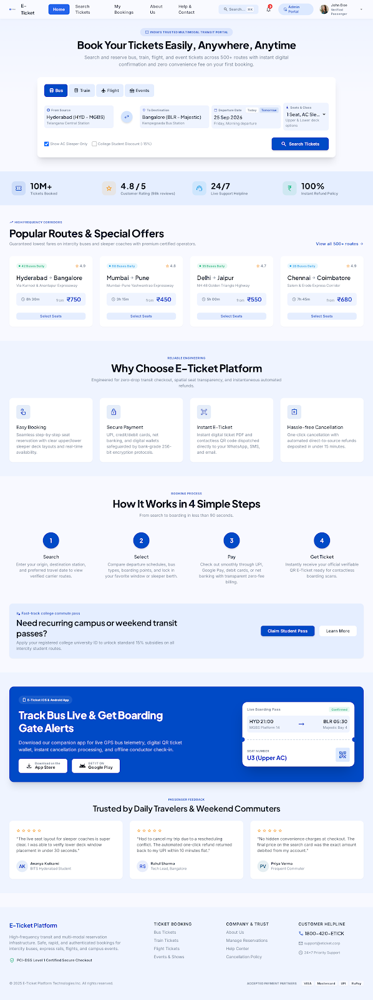
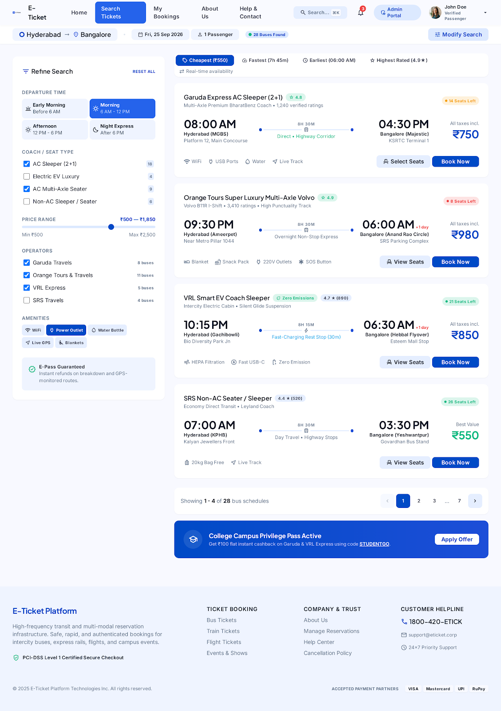
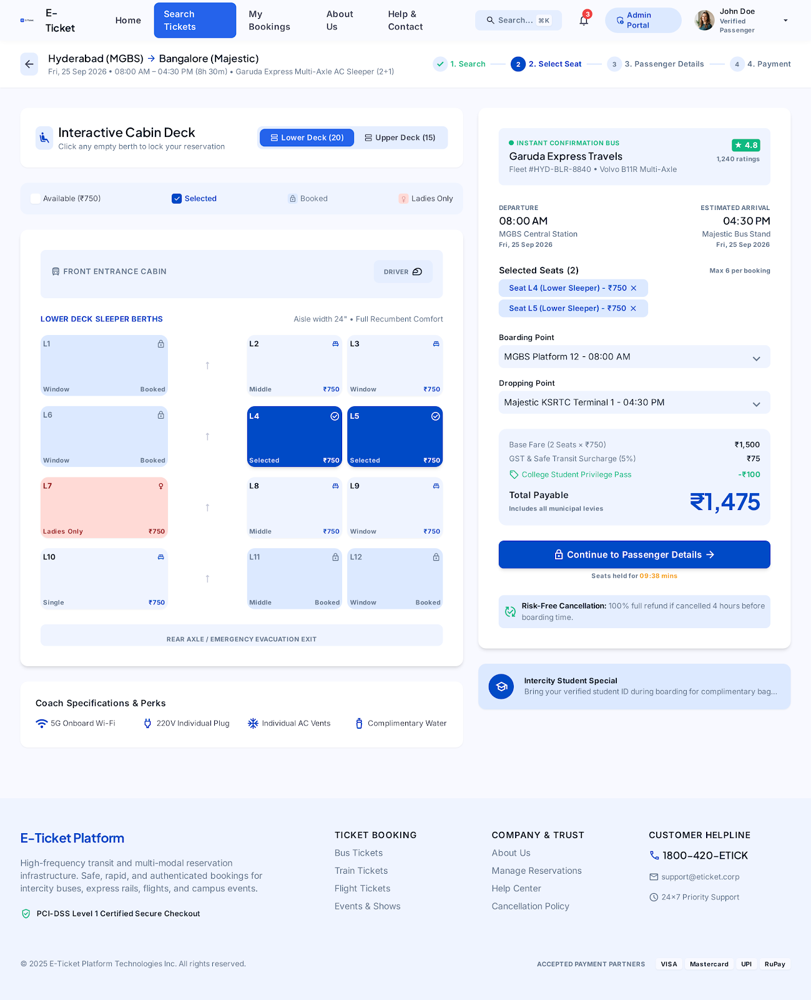
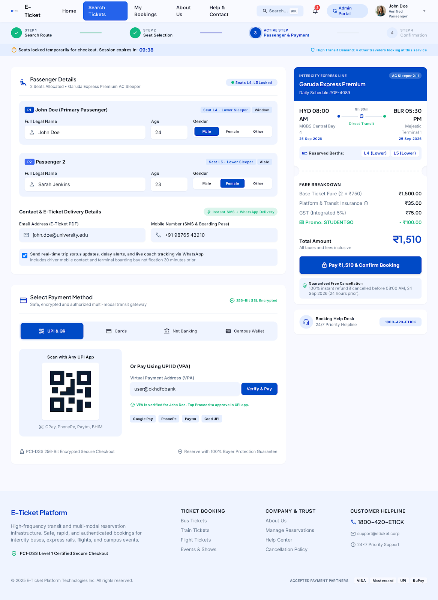
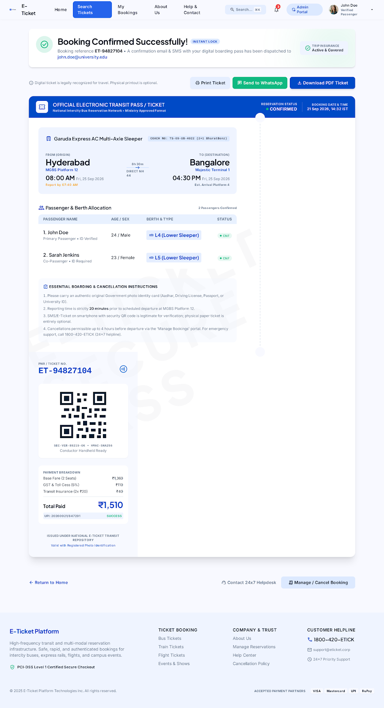

# 🎟️ E-Ticketing Platform

A modern web-based **E-Ticketing Platform** that allows users to search for available tickets, select seats, enter passenger details, make payments, and receive digital e-tickets.

The project is designed to simplify the traditional ticket-booking process by providing a convenient, fast, and user-friendly online platform.

---








---

## 📌 Project Overview

The E-Ticketing Platform provides an interactive interface for users to manage the complete ticket-booking process online.

Users can:

- Search for available tickets
- Check schedules and availability
- Select seats
- Enter passenger details
- Make payments
- Receive booking confirmation
- View their bookings
- Access their e-tickets
- Cancel bookings

The project also includes backend services and Firebase integration for managing application data.

---

## 🎯 Objectives

The main objectives of this project are:

1. To provide an easy-to-use online ticket booking system.
2. To reduce the need for manual ticket booking.
3. To allow users to check ticket availability online.
4. To provide convenient seat selection.
5. To simplify passenger information management.
6. To provide digital ticket generation.
7. To maintain booking information efficiently.
8. To provide a responsive and interactive user interface.

---

## ✨ Features

### 👤 User Features

- User registration and login
- Search tickets
- View available schedules
- View ticket information
- Select seats
- Enter passenger details
- Online payment interface
- Booking confirmation
- Digital e-ticket
- View booking history
- Ticket cancellation
- Help and contact section
- About Us section

### 🚌 Ticket Booking

The booking flow follows:

```text
Search
   ↓
Select Ticket
   ↓
Select Seat
   ↓
Passenger Details
   ↓
Payment
   ↓
Booking Confirmation
   ↓
E-Ticket

